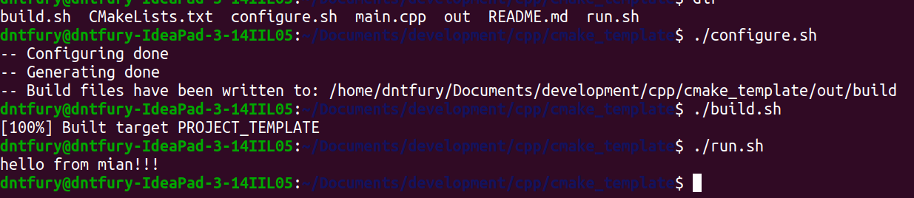
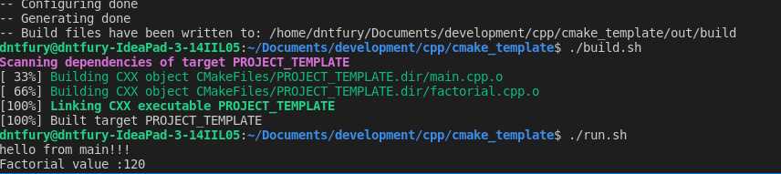
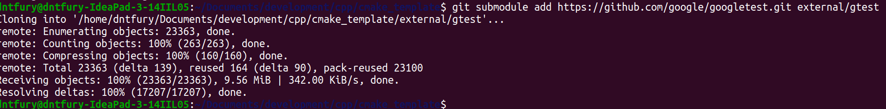

# Cmake Template 
@dntfury

# Using make file
    Makefile
        default:
            g++ main.cpp -o out
    command
        $make
    

# Using CMakefiles.txt

    #Define min version
    cmake_minimum_required(VERSION 3.16.3)

    #Name Project
    project(PROJECT_TEMPLATE)

    #add the main.cpp
    add_executable(${PROJECT_NAME} main.cpp)

** This is minimum for this template

### Create a out/build directory in main directory
    
    mkdir -p out/build/

### Change the permision by 

    chmod +x configure.sh build.sh run.sh
    
    ** We also need to change project directory name in run.sh accordingly to CMakeLists.txt ${PROJECT_NAME}

Run full code by

    ./configure.sh
    ./build.sh
    ./run.sh

### Preview

## Adding more files to the project Simple Part

    -Declare file.cxx
    -Declare in main.cxx
    -In CMakeListes modify :
        add_executable(${PROJECT_NAME} main.cpp factorial.cpp)

 
 
 

## Build and add library

- Make foder for lib* and add programm.cxx and program.h
- Include program.h in program.cxx
- touch CMakeLists.txt file in in Lib*
    
        add_library(<name> factorial.cxx)

In main CMakeLists.txt

    add_subdirectory(Lib*)
    target_link_libraries(${PROJECT_NAME} <name>)

    Note Lib was Fatorial folder.

## Adding submodule

    git submodule add https://github.com/google/googletest.git external/gtest

    

